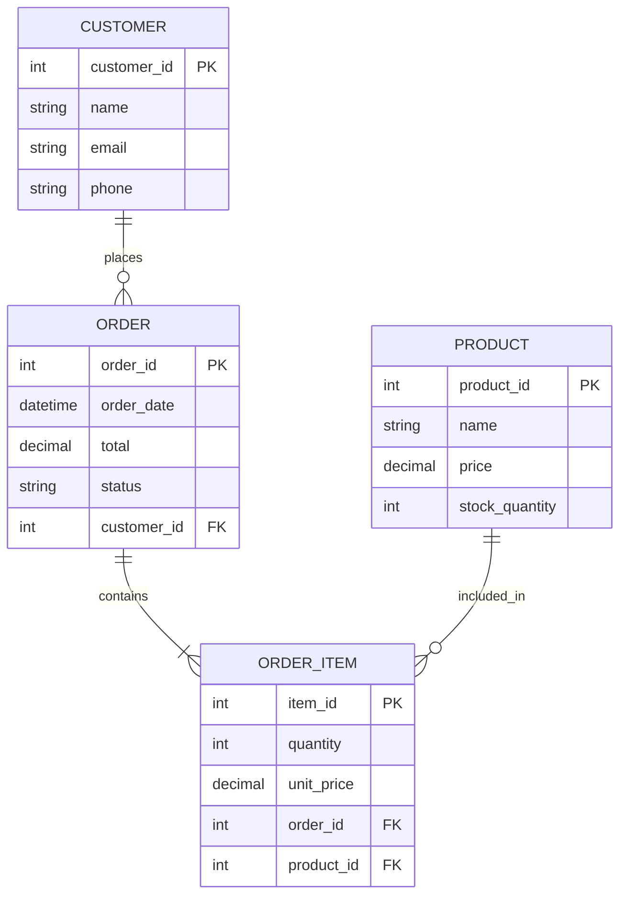
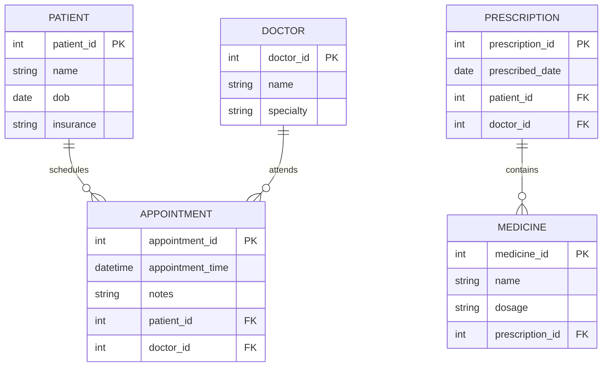

# 📊 Database ER Diagrams (Entity Relationship Models)

---

## 🏦 Bank Database ER Diagram

```mermaid
erDiagram
    CUSTOMER ||--o{ ACCOUNT : "has"
    CUSTOMER {
        int customer_id PK
        string name
        string email
        string phone
    }
    ACCOUNT {
        int account_id PK
        string account_type
        decimal balance
        date opened_date
        int customer_id FK
    }
    ACCOUNT ||--o{ TRANSACTION : "records"
    TRANSACTION {
        int transaction_id PK
        datetime transaction_date
        decimal amount
        string transaction_type
        int account_id FK
    }
````

### 🔑 Key Components:

* **Entities**: `CUSTOMER`, `ACCOUNT`, `TRANSACTION`
* **Relations**:

  * One `CUSTOMER` → Many `ACCOUNT`s
  * One `ACCOUNT` → Many `TRANSACTION`s
* **Keys**:

  * `PK`: Primary Key
  * `FK`: Foreign Key

---

## 🎓 University Database ER Diagram

```mermaid
erDiagram
    STUDENT ||--o{ ENROLLMENT : "enrolls_in"
    STUDENT {
        int student_id PK
        string full_name
        date dob
        string email
    }
    COURSE ||--o{ ENROLLMENT : "has"
    COURSE {
        int course_id PK
        string title
        int credit_hours
        string course_code
    }
    PROFESSOR ||--o{ COURSE : "teaches"
    ENROLLMENT {
        int enrollment_id PK
        date enrollment_date
        string grade
        int student_id FK
        int course_id FK
    }
    PROFESSOR {
        int professor_id PK
        string name
        string department
    }
```

---

## 🛒 E-Commerce Database ER Diagram



---

## 🏥 Hospital Database ER Diagram



---

## 🛠 How to Build ERDs

### 1. Identify Entities

Think in **nouns**: Customer, Order, Product, etc.

### 2. Define Relationships

Use **verbs**: places, contains, teaches, etc.

### 3. Set Cardinality

* `||--o{` = One-to-Many
* `||--||` = One-to-One
* `}o--o{` = Many-to-Many

### 4. List Attributes

Use simplified types for Mermaid: `int`, `string`, `date`, `decimal`, `datetime`

### 5. Tools

* 🛠 [MySQL Workbench](https://www.mysql.com/products/workbench/)
* 🖼️ [Draw.io / diagrams.net](https://draw.io)
* 🔗 [Lucidchart](https://lucidchart.com)
* ✍️ Mermaid.js (works in GitHub Markdown)


