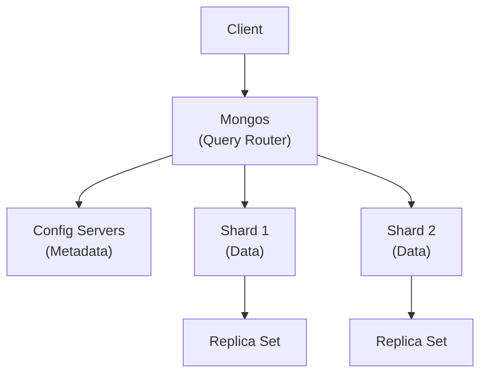
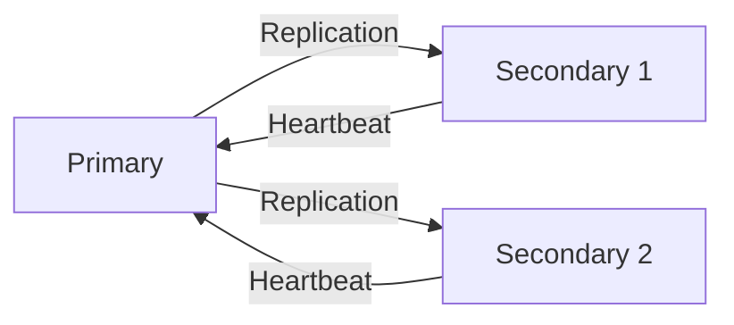
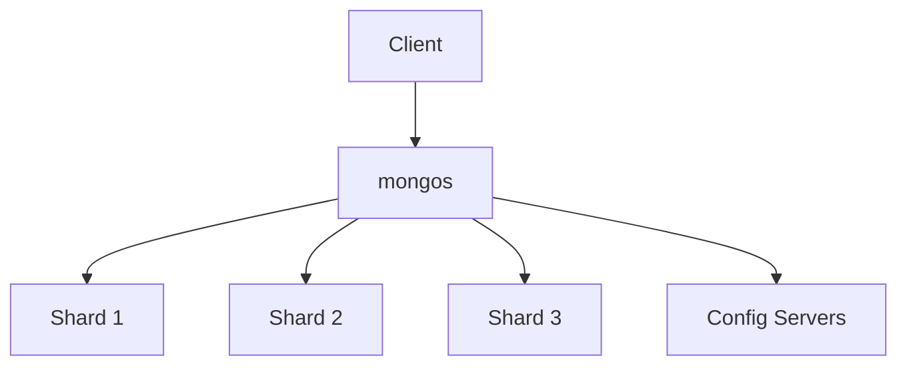

# 🍃 MongoDB Architecture



## 🔹 Core Components

### 1. **mongod** (Database Process)

* Primary storage engine (WiredTiger by default)
* Handles CRUD operations
* Manages data files (BSON format)

### 2. **mongos** (Query Router)

* Routes requests in sharded clusters
* Aggregates results from shards
* No persistent state

### 3. **Config Servers**

* Store cluster metadata
* Shard locations and chunk ranges
* Must be replica set (for high availability)

## 🔹 Data Organization

### Storage Hierarchy:

```
Database → Collections → Documents → Fields
```

### Document Structure:

```javascript
{
  _id: ObjectId("..."), // Primary key
  field1: "value",
  field2: 123,
  nested: { ... },
  array: [ ... ]
}
```

## 🔹 Replication Architecture



* **Primary**: Accepts all writes
* **Secondaries**: Read-only copies
* **Automatic failover** (election process)

## 🔹 Sharding Architecture



* **Shard Key**: Determines data distribution
* **Chunks**: Data partitions (\~64MB-128MB)
* **Balancer**: Evenly distributes chunks

## 🔹 Query Execution Flow

1. Client sends query to mongos
2. mongos checks config servers for:

   * Which shards have relevant data
   * Chunk distribution
3. mongos routes query to appropriate shards
4. Shards return results to mongos
5. mongos merges and returns final result

## 🔹 Memory Structure

| Area             | Purpose                         |
| ---------------- | ------------------------------- |
| WiredTiger Cache | Caches frequently accessed data |
| Journal          | Crash recovery logs             |
| Filesystem Cache | OS-level caching                |

