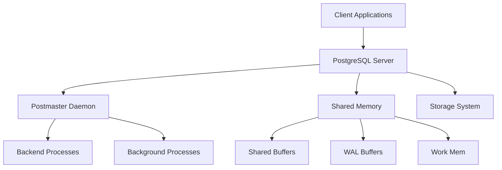
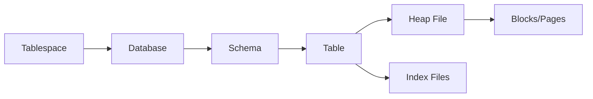
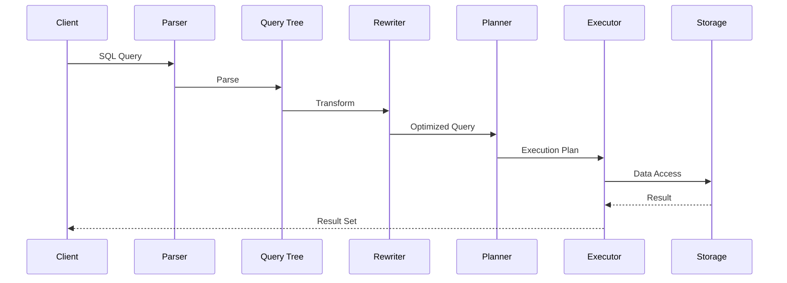
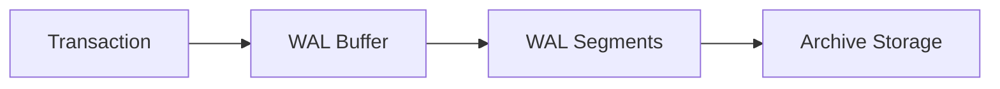
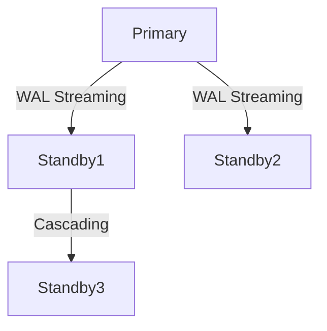

# 🏛 PostgreSQL Architecture Overview

## 🔹 PostgreSQL System Architecture



## 🔸 Core Components

### 1. Postmaster Daemon
- Master process that manages the database server
- Listens for connection requests (default port: 5432)
- Forks new backend process for each connection
- Manages background processes

### 2. Backend Processes
- One process per client connection
- Handles query parsing, optimization, and execution
- Isolated from other connections (no shared memory between backends)

### 3. Shared Memory
- Memory area accessible to all processes

| Component         | Description                          | Typical Size          |
|-------------------|--------------------------------------|-----------------------|
| Shared Buffers    | Caches frequently accessed data      | 25% of total RAM      |
| WAL Buffers       | Temporary storage for write-ahead logs | 1-16MB               |
| Work Memory       | Per-operation working memory         | Configurable per query|
| Maintenance Mem   | Memory for maintenance operations    | Configurable         |

### 4. Background Processes

| Process           | Function                             |
|-------------------|--------------------------------------|
| Checkpointer      | Writes dirty buffers to disk         |
| Background Writer | Periodically flushes dirty buffers   |
| WAL Writer       | Writes WAL data to disk              |
| Autovacuum       | Automatically vacuums tables         |
| Stats Collector  | Gathers database statistics          |
| Logger          | Logs server messages                 |

## 🔹 Storage Architecture

### Tablespace Structure


### Page Layout (8KB Block)
```
+---------------------+
| Page Header (24B)   |
+---------------------+
| Line Pointers       |
| (Item pointers)     |
+---------------------+
| Free Space          |
+---------------------+
| Tuples (Row Data)   |
+---------------------+
| Special Space       |
| (Index-only)        |
+---------------------+
```

## 🔹 Query Processing Pipeline



### Key Stages:
1. **Parser**: Checks syntax, creates parse tree
2. **Rewriter**: Handles views/rules
3. **Planner/Optimizer**: Generates execution plan
4. **Executor**: Runs the plan

## 🔹 Concurrency Control (MVCC)

PostgreSQL uses Multi-Version Concurrency Control:
- Each transaction sees a snapshot of data
- No locks for read operations
- Writers don't block readers
- Uses transaction IDs (xmin, xmax) in tuple headers

```
Tuple Header:
+---------------------+
| xmin (32-bit)       | → Creating transaction ID
+---------------------+
| xmax (32-bit)       | → Deleting transaction ID
+---------------------+
| ctid (32-bit)       | → Current tuple identifier
+---------------------+
| infomask (16-bit)   | → Status flags
+---------------------+
```

## 🔹 Write-Ahead Logging (WAL)

### WAL Architecture


Key Features:
- Crash recovery guarantee
- Point-in-time recovery (PITR)
- Streaming replication
- WAL segments are 16MB by default

## 🔹 Replication Architecture



Types:
1. **Physical Replication**: Exact byte-for-byte copy
2. **Logical Replication**: Selective table replication
3. **Synchronous vs Asynchronous**

## 🔹 Memory Contexts

PostgreSQL uses hierarchical memory management:
```
Top Memory Context
│
├── Postmaster Context
│
├── Backend Context
│   ├── Parser Context
│   ├── Executor Context
│   └── ...
│
└── Transaction Context
    ├── Query Context
    └── ...
```

Benefits:
- Efficient memory allocation
- Automatic cleanup at context destruction
- Reduced memory leaks

## 🔹 Configuration Files

| File               | Purpose                          |
|--------------------|----------------------------------|
| postgresql.conf    | Main configuration parameters    |
| pg_hba.conf        | Client authentication rules      |
| pg_ident.conf      | User name mapping               |
| postgresql.auto.conf| ALTER SYSTEM generated settings |

## 🔹 Monitoring Views

Key system catalogs for monitoring:
```sql
SELECT * FROM pg_stat_activity;  -- Current connections
SELECT * FROM pg_stat_database;  -- Database-level stats
SELECT * FROM pg_stat_user_tables; -- Table access stats
SELECT * FROM pg_locks;          -- Current locks
```

## 🔹 Extension System

PostgreSQL's modular architecture supports extensions:
```sql
CREATE EXTENSION pg_trgm;  -- Text similarity
CREATE EXTENSION postgis;  -- Geographic objects
CREATE EXTENSION hstore;   -- Key-value storage
```

